# Estimation and Detection Theory — Laboratory Coursework (AUTh 2024)

[]()
[](https://ece.auth.gr/)
[](LICENSE)

Comprehensive computational study and analytical derivations for statistical signal processing, parameter estimation, and hypothesis testing. Completed for the **Estimation and Detection Theory** course at the [Department of Electrical and Computer Engineering](https://ece.auth.gr/), [Aristotle University of Thessaloniki](https://www.auth.gr/) (8th Semester, Spring 2024).

* **Instructor**: Asst. Prof. Panagiotis Petrantonakis
* **Authors**: Dimitrios Ioannidis, Anastasios Theocharis Sotiropoulos

---

## 📑 Table of Contents
1. [Coursework Architecture](#-coursework-architecture)
2. [Topic 1: Exponential Parameter Estimation (CRLB & MLE)](#-topic-1-exponential-parameter-estimation-crlb--mle)
3. [Topic 2: Classical Linear Model & Bayesian Estimation (MMSE vs. MLE)](#-topic-2-classical-linear-model--bayesian-estimation-mmse-vs-mle)
4. [Topic 3: Distribution Identification & ML Hypothesis Testing](#-topic-3-distribution-identification--ml-hypothesis-testing)
5. [Running the Experiments](#-running-the-experiments)

---

## 🏛️ Coursework Architecture

```
estimation-and-detection-theory-auth-2024/
├── assignment/
│   └── DET_Assignment_2024-1.pdf            # Original Greek assignment brief
├── assets/                                   # High-resolution simulation figures
│   ├── 01-exponential-parameter-estimation/
│   ├── 02-bayesian-mmse-vs-mle/
│   └── 03-distribution-identification/
├── 01-exponential-parameter-estimation/
│   ├── crlb_imvue_simulation.m              # CRLB derivation & ideal MVUE Monte Carlo
│   ├── mle_estimation.m                     # MLE derivation, small-sample bias
│   └── sample_size_comparison.m             # Asymptotic efficiency across N = {10, 20, 50, 100}
├── 02-bayesian-mmse-vs-mle/
│   ├── mmse_vs_mle.m                        # Bayesian MMSE vs Classical MLE convergence
│   └── prior_misspecification.m             # Robustness under Uniform and Exponential priors
├── 03-distribution-identification/
│   ├── fit_distributions.m                  # MLE derivations (Exp vs Rayleigh) & bin MSE testing
│   └── data.mat                             # Empirical dataset (N = 1000)
├── .gitignore
└── LICENSE                                  # MIT License
```

---

## 🎯 Topic 1: Exponential Parameter Estimation (CRLB & MLE)

### 1.1 Mathematical Formulation & CRLB Derivation

Consider independent and identically distributed (i.i.d.) observations drawn from an Exponential distribution:
$$p(x; \lambda) = \lambda e^{-\lambda x}, \quad x > 0$$

For a sample vector $\mathbf{x} = [x[0], x[1], \dots, x[N-1]]^T$, the joint likelihood and log-likelihood functions are:
$$p(\mathbf{x}; \lambda) = \prod_{n=0}^{N-1} \lambda e^{-\lambda x[n]} = \lambda^N \exp\left(-\lambda \sum_{n=0}^{N-1} x[n]\right)$$

$$\ln p(\mathbf{x}; \lambda) = N \ln \lambda - \lambda \sum_{n=0}^{N-1} x[n]$$

The score function (first derivative) is:
$$\frac{\partial \ln p(\mathbf{x}; \lambda)}{\partial \lambda} = \frac{N}{\lambda} - \sum_{n=0}^{N-1} x[n]$$

Differentiating again yields the second derivative:
$$\frac{\partial^2 \ln p(\mathbf{x}; \lambda)}{\partial \lambda^2} = -\frac{N}{\lambda^2}$$

The Fisher Information $I(\lambda)$ is:
$$I(\lambda) = -\mathbb{E}\left[\frac{\partial^2 \ln p(\mathbf{x}; \lambda)}{\partial \lambda^2}\right] = \frac{N}{\lambda^2}$$

Therefore, the **Cramér-Rao Lower Bound (CRLB)** for any unbiased estimator $\hat{\lambda}$ is:
$$\text{Var}(\hat{\lambda}) \ge \frac{1}{I(\lambda)} = \frac{\lambda^2}{N}$$

For $\lambda = 2$ and $N = 10$, $\text{CRLB} = \frac{2^2}{10} = 0.400$.

Setting the score function to zero yields the **Maximum Likelihood Estimator (MLE)**:
$$\frac{\partial \ln p(\mathbf{x}; \lambda)}{\partial \lambda} = 0 \implies \hat{\lambda}_{\text{MLE}} = \frac{N}{\sum_{n=0}^{N-1} x[n]} = \frac{1}{\bar{x}}$$

### 1.2 Small-Sample Comparison ($N = 10$, 5000 Experiments)

While an ideal Minimum Variance Unbiased Estimator (IMVUE) achieving the CRLB has asymptotic normal distribution $\hat{\lambda}_{\text{IMVUE}} \sim \mathcal{N}(\lambda, \text{CRLB})$, the MLE $\hat{\lambda}_{\text{MLE}} = 1/\bar{x}$ is non-linear and exhibits small-sample bias:
$$\mathbb{E}[\hat{\lambda}_{\text{MLE}}] = \frac{N}{N - 1}\lambda = \frac{10}{9}(2) \approx 2.222$$

| Ideal MVUE ($\text{CRLB} = 0.400$) | Maximum Likelihood Estimator (MLE) |
| :---: | :---: |
| 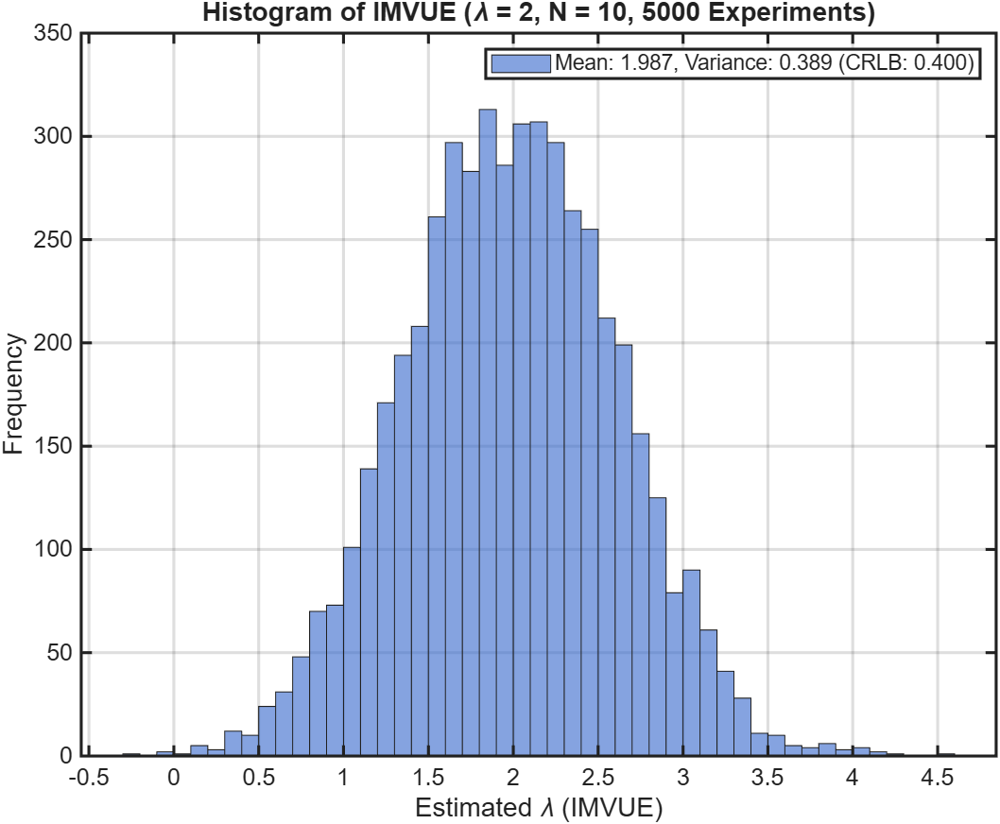 | 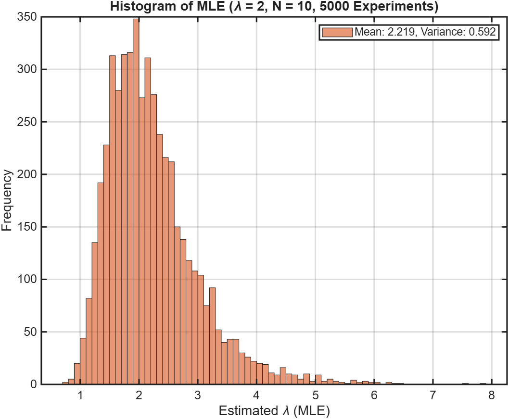 |
| **Mean**: $2.002$ \| **Variance**: $0.402$ | **Mean**: $2.221$ \| **Variance**: $0.613$ |

### 1.3 Asymptotic Efficiency Across Sample Sizes $N$

We evaluate estimator behavior across increasing sample sizes $N \in \{10, 20, 50, 100\}$ over $5000$ Monte Carlo runs:

| Sample Size | IMVUE vs. MLE Distribution Comparison |
| :---: | :---: |
| **$N = 10$** | 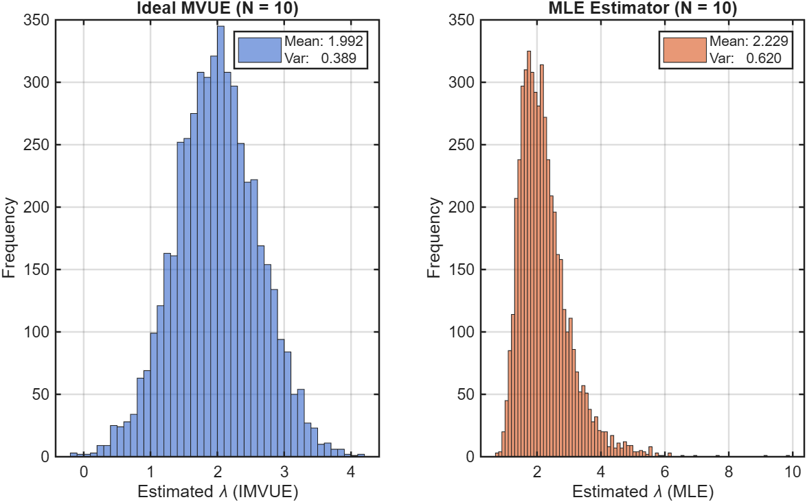 |
| **$N = 20$** | 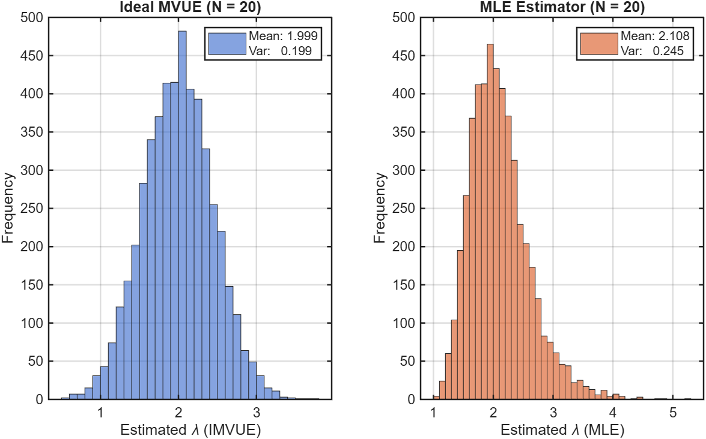 |
| **$N = 50$** | 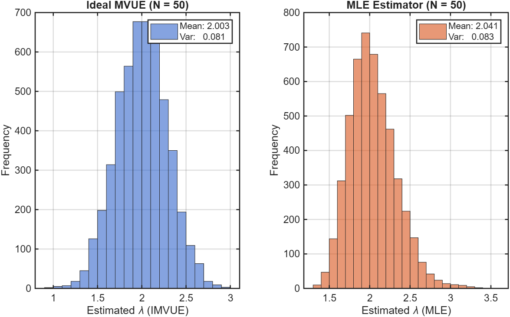 |
| **$N = 100$** | 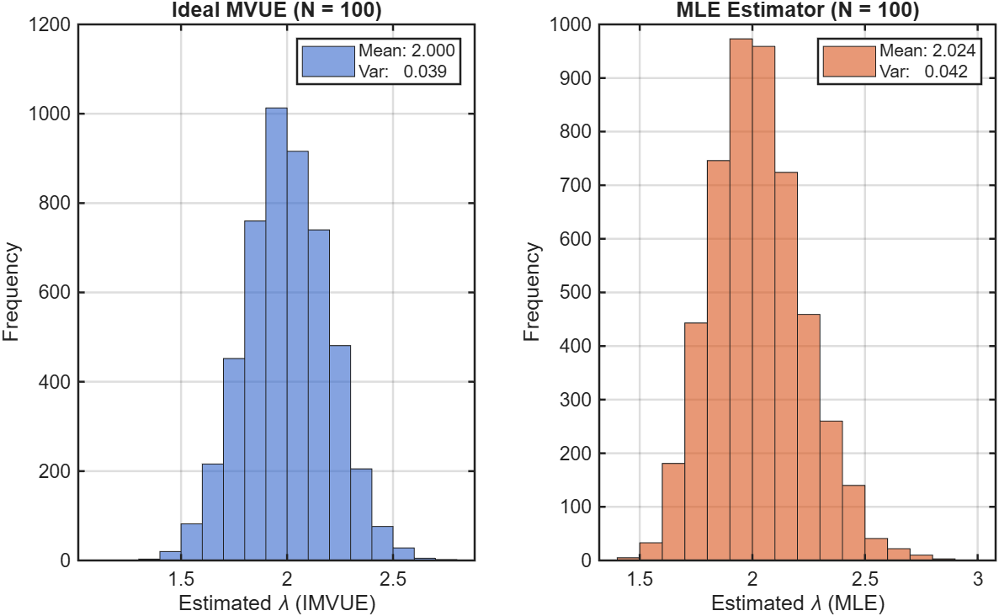 |

**Key Takeaways**:
1. **Asymptotic Unbiasedness**: As $N \to \infty$, the positive small-sample bias of the MLE vanishes ($\mathbb{E}[\hat{\lambda}_{\text{MLE}}] \to 2.00$).
2. **Asymptotic Efficiency**: The empirical variance of $\hat{\lambda}_{\text{MLE}}$ converges to the CRLB bound ($\sigma^2 \to \lambda^2 / N$).
3. **Asymptotic Normality**: In accordance with the Central Limit Theorem and classical ML theory, the skewed distribution of $\hat{\lambda}_{\text{MLE}}$ transforms into a symmetric Gaussian bell shape.

---

## ⚖️ Topic 2: Classical Linear Model & Bayesian Estimation (MMSE vs. MLE)

### 2.1 System & Observation Model

Consider the linear scalar measurement system:
$$x[n] = h\theta + w[n], \quad n = 0, 1, \dots, N-1$$
where $h = 0.5$, and noise is zero-mean Additive White Gaussian Noise (AWGN): $w[n] \overset{\text{i.i.d.}}{\sim} \mathcal{N}(0, \sigma_w^2 = 4)$.

### 2.2 Bayesian Minimum Mean Squared Error (MMSE) Estimator
Under a Bayesian paradigm where the parameter $\theta$ is modeled as a random variable rather than a fixed deterministic constant, the **Minimum Mean Squared Error (MMSE)** estimator minimizes the posterior mean squared error $\mathbb{E}[(\hat{\theta} - \theta)^2]$.

Given a Gaussian prior $\theta \sim \mathcal{N}(\mu_\theta = 4, \sigma_\theta^2 = 1)$, the joint distribution of $[\theta, \mathbf{x}]^T$ is Gaussian. The optimal MMSE estimator is the posterior conditional mean $\hat{\theta}_{\text{MMSE}} = \mathbb{E}[\theta|\mathbf{x}]$:
$$\hat{\theta}_{\text{MMSE}} = \mu_\theta + \mathbf{C}_{\theta\mathbf{x}} \mathbf{C}_{\mathbf{x}}^{-1} (\mathbf{x} - \boldsymbol{\mu}_{\mathbf{x}}) = \frac{2}{16 + N}\sum_{n=0}^{N-1} x[n] - \frac{4N}{16 + N} + 4$$

The theoretical Bayesian Mean Squared Error (BMSE) is:
$$\text{Bmse}(\hat{\theta}_{\text{MMSE}}) = \frac{\sigma_\theta^2 \sigma_w^2}{N h^2 \sigma_\theta^2 + \sigma_w^2} = \frac{16}{16 + N}$$

### 2.3 Classical Maximum Likelihood Estimator (MLE)
Assuming $\theta$ is an unknown deterministic parameter (with true value $\theta = 4$):
$$\hat{\theta}_{\text{MLE}} = (h^T h)^{-1} h^T \mathbf{x} = \frac{1}{Nh}\sum_{n=0}^{N-1} x[n] = \frac{2}{N}\sum_{n=0}^{N-1} x[n]$$

The theoretical variance is:
$$\text{Var}(\hat{\theta}_{\text{MLE}}) = \frac{\sigma_w^2}{N h^2} = \frac{16}{N}$$

### 2.4 MSE Convergence: Bayesian MMSE vs. Classical MLE

Monte Carlo simulation across $500$ realizations for $N \in [1, 50]$ observations:

| MMSE Convergence | MLE Convergence | Dual Comparison |
| :---: | :---: | :---: |
| 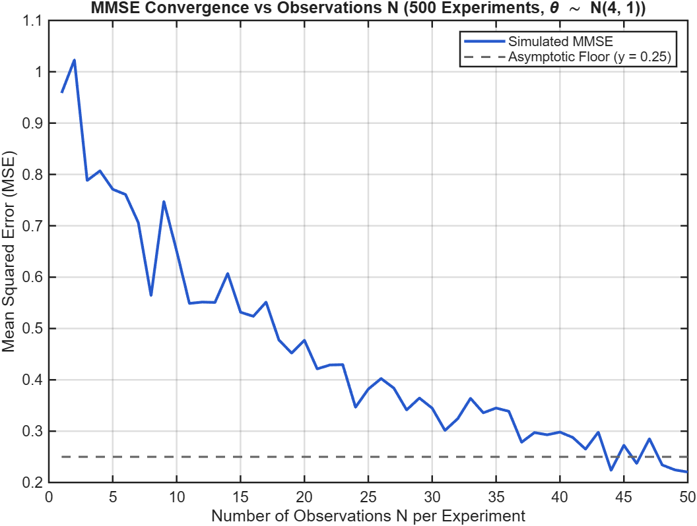 | 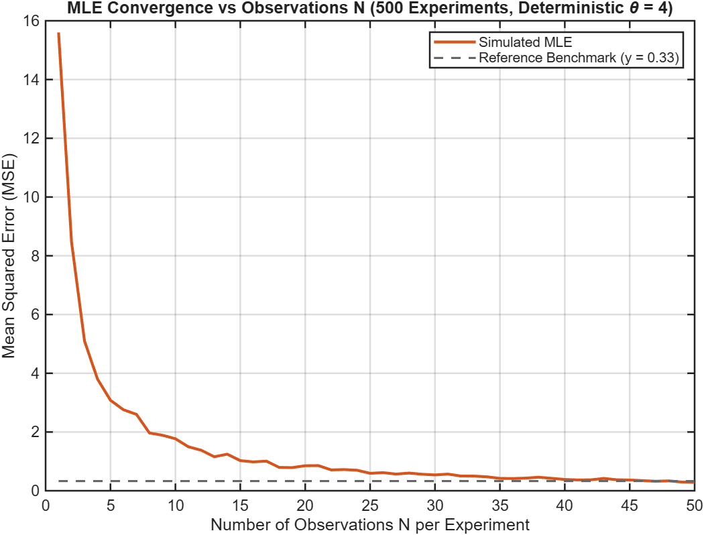 | 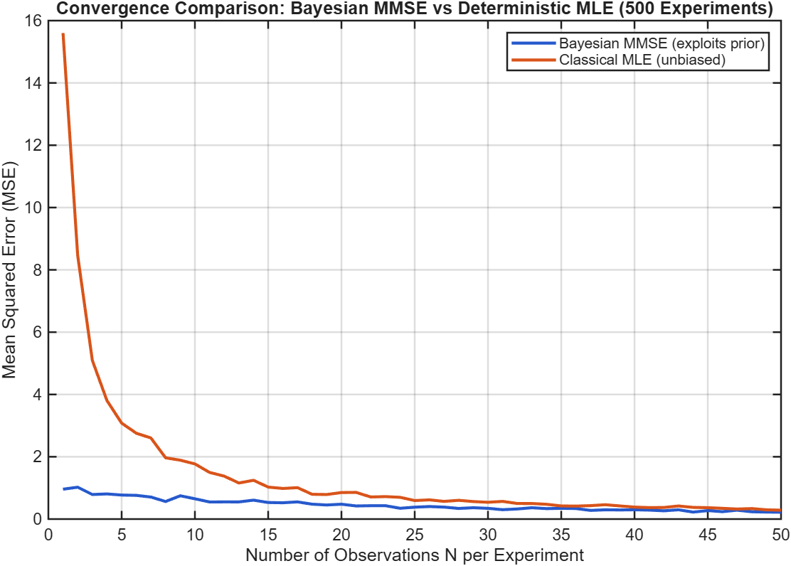 |

* **Low-$N$ Regime**: Bayesian MMSE substantially outperforms MLE ($\text{MSE} \approx 0.94$ vs $16.0$ at $N = 1$) by regularizing towards the prior $\mathcal{N}(4, 1)$.
* **High-$N$ Regime**: As data accumulates, the likelihood dominates the prior, and both estimators asymptotically converge.

### 2.5 Robustness Under Misspecified Priors

We evaluate how the MMSE estimator (which assumes $\theta \sim \mathcal{N}(4, 1)$) performs when the underlying ground-truth distribution of $\theta$ is misspecified:

1. **Uniform Distribution** $\theta \sim \mathcal{U}[a, b]$ with matched mean and variance:
   $$a = 4 - \sqrt{3} \approx 2.27, \quad b = 4 + \sqrt{3} \approx 5.73$$
2. **Exponential Distribution** $\theta \sim \text{Exp}(\lambda = 0.25)$ with matched mean ($\mu = 1/\lambda = 4$, variance $\sigma^2 = 1/\lambda^2 = 16$).

| Uniform Misspecified Prior ($\mu = 4, \sigma^2 = 1$) | Exponential Misspecified Prior ($\mu = 4, \sigma^2 = 16$) |
| :---: | :---: |
| 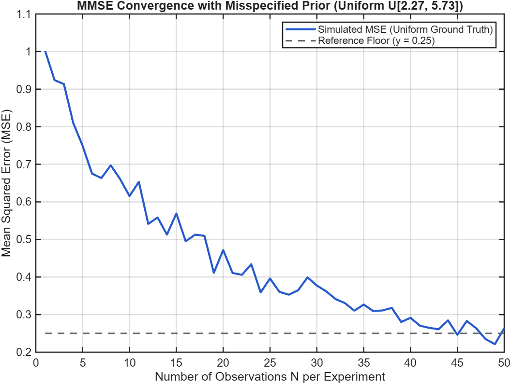 | 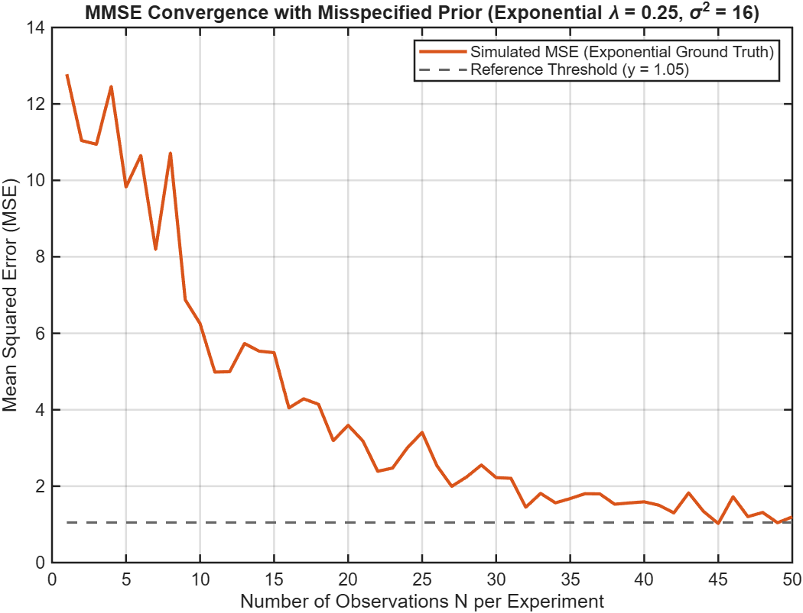 |

* **Uniform Case**: Because the first two moments ($\mu = 4, \sigma^2 = 1$) and spatial symmetry closely mirror the Gaussian prior, the MMSE estimator displays remarkable robustness with negligible degradation.
* **Exponential Case**: Due to strong asymmetric skewness and higher variance ($\sigma^2 = 16$), the MSE is initially elevated for small sample sizes ($N < 10$). However, as $N$ increases, the misspecified prior is washed out by data evidence.

---

## 🔍 Topic 3: Distribution Identification & ML Hypothesis Testing

### 3.1 Problem Statement
An empirical dataset $\mathbf{x} \in \mathbb{R}^{1000}$ (`data.mat`) is known to have been sampled from either an **Exponential** or a **Rayleigh** distribution. We formulate candidate ML estimators and determine the underlying generating process.

### 3.2 Maximum Likelihood Derivations

#### Candidate 1: Exponential Distribution
$$p(x; \lambda) = \lambda e^{-\lambda x} \implies \hat{\lambda}_{\text{MLE}} = \frac{1}{\bar{x}} = \frac{1}{0.1283} \approx 7.7948$$

#### Candidate 2: Rayleigh Distribution
The PDF parameterized by $\theta = \sigma^2$ is:
$$p(x; \theta) = \frac{x}{\theta} \exp\left(-\frac{x^2}{2\theta}\right), \quad x \ge 0$$

Joint log-likelihood:
$$\ln p(\mathbf{x}; \theta) = -N \ln \theta + \sum_{n=0}^{N-1} \ln x[n] - \frac{1}{2\theta}\sum_{n=0}^{N-1} x[n]^2$$

Setting the derivative to zero:
$$\frac{\partial \ln p(\mathbf{x}; \theta)}{\partial \theta} = -\frac{N}{\theta} + \frac{1}{2\theta^2}\sum_{n=0}^{N-1} x[n]^2 = 0 \implies \hat{\sigma}^2_{\text{MLE}} = \frac{1}{2N}\sum_{n=0}^{N-1} x[n]^2 \approx 0.0103$$
which yields scale parameter $\hat{\sigma}_{\text{MLE}} \approx 0.1016$.

### 3.3 Visual and Quantitative Goodness-of-Fit

Using the fitted parameters, synthetic datasets are sampled and evaluated against the empirical distribution using normalized histogram bin Mean Squared Error (MSE):

| Empirical Data (`data.mat`) | Fitted Exponential Distribution | Fitted Rayleigh Distribution |
| :---: | :---: | :---: |
| 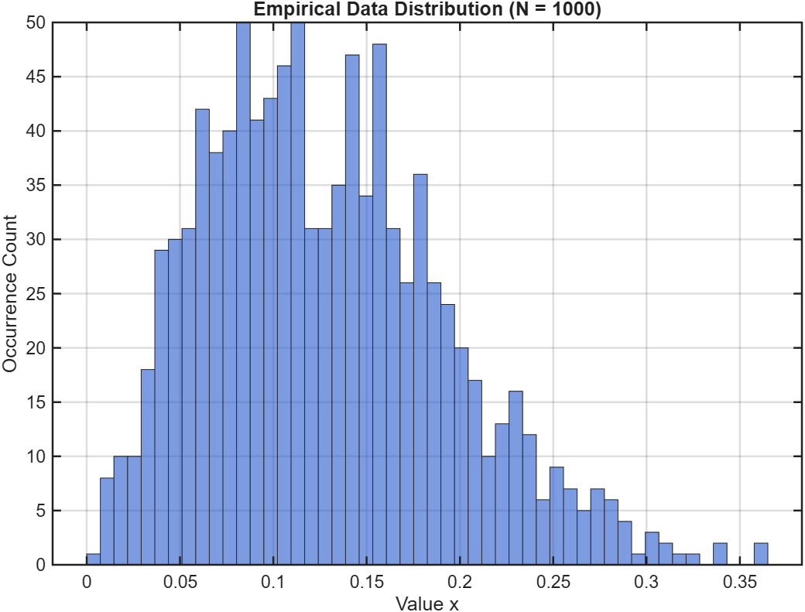 | 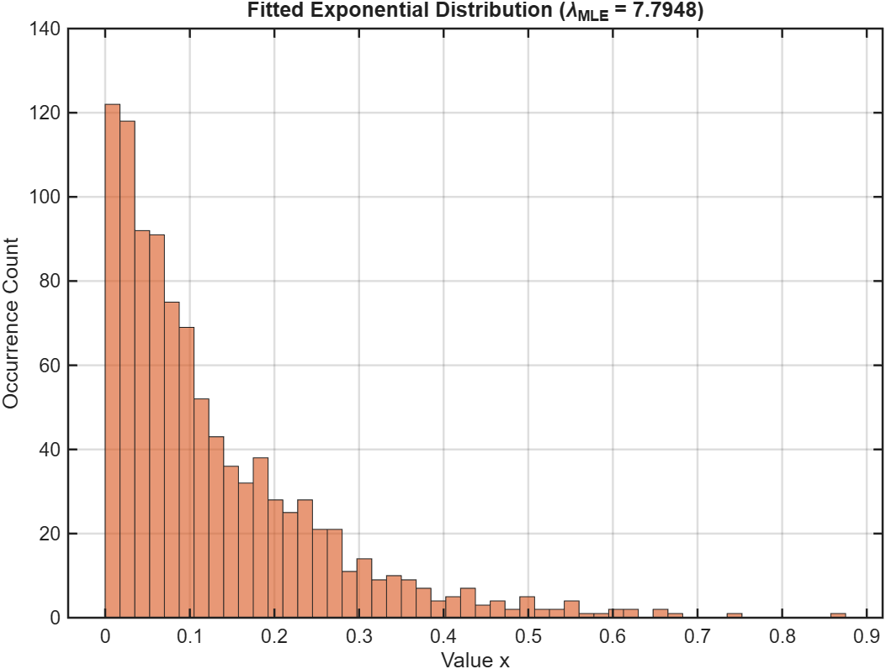 | 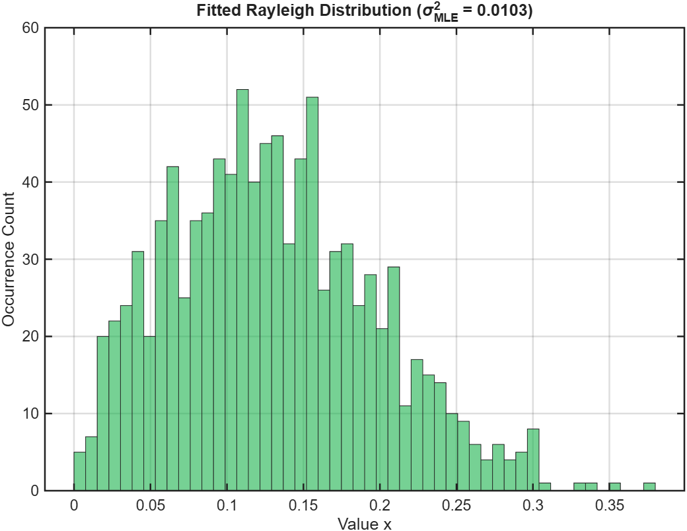 |

```
Dataset Analysis: Sample Size N = 1000
  Sample Mean:     0.1283
  Sample Variance: 0.0042

MLE Parameters:
  Exponential:  lambda_hat  = 7.7948
  Rayleigh:     sigma^2_hat = 0.0103 (sigma = 0.1016)

Goodness-of-Fit Comparison (Histogram Bin MSE):
  MSE (Data vs. Exponential): 1142.32
  MSE (Data vs. Rayleigh):      52.20
```

**Conclusion**:
The Rayleigh distribution achieves an order-of-magnitude superior fit ($\text{MSE} = 52.20$ vs. $1142.32$, a $95.4\%$ reduction in error). The empirical data decisively originates from a **Rayleigh distribution**.

---

## 🚀 Running the Experiments

All scripts are self-contained and run on standard MATLAB without requiring external toolboxes (built-in fallbacks for `normrnd`, `exprnd`, `unifrnd`, and `raylrnd` are included).

1. **Topic 1 — Exponential CRLB & MLE**:
   ```matlab
   cd('01-exponential-parameter-estimation');
   crlb_imvue_simulation;       % Part 1: CRLB and IMVUE histogram
   mle_estimation;              % Part 2: MLE histogram and small-sample bias
   sample_size_comparison;      % Part 3: Asymptotic efficiency across N
   ```

2. **Topic 2 — Bayesian MMSE vs. Classical MLE**:
   ```matlab
   cd('02-bayesian-mmse-vs-mle');
   mmse_vs_mle;                 % Part 3: MSE convergence comparison
   prior_misspecification;      % Part 4: Robustness under Uniform & Exponential priors
   ```

3. **Topic 3 — Distribution Identification**:
   ```matlab
   cd('03-distribution-identification');
   fit_distributions;           % Fits models, computes MSE, and outputs verdict
   ```
